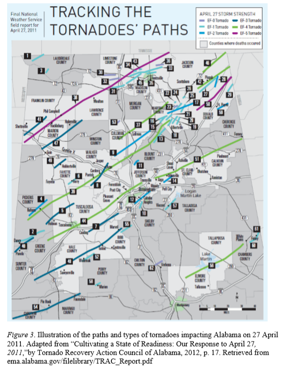
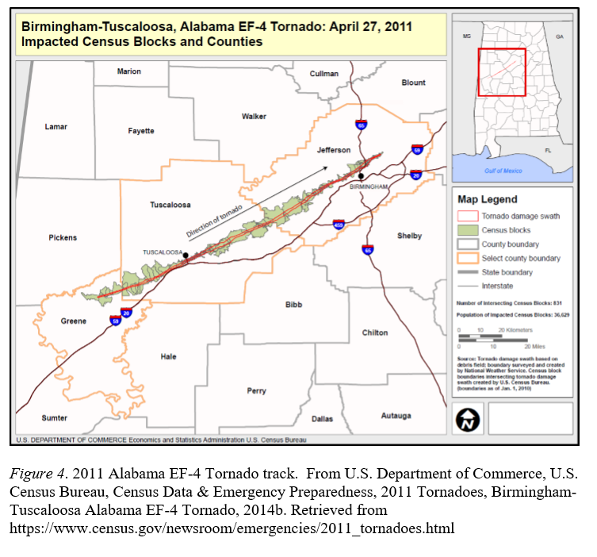

# [@kinney2008autism]

This study investigated whether the prevalence of autistic disorder in children was
associated with whether the child was exposed in utero to a severe hurricane, 
investigating for different stages of gestational development [?]. The study 
was conducted in [which part of? all? coastal?] Louisiana for 1980--1995.

## Temporal Scale

- Severe storms between 1980 and 1995 were identified. [The study links exposure by the
day of the storm (true?), but since it is linking to gestational period (measure of 
week of gestational period is probably as refined as you can get on that), a week-level
temporal scale would have probably worked fine for this study.]

## Spatial Scale:

- "National Weather Service maps of storm tracks were used to identify the parishes that were hit by the centers of each storm, and thus were likely to have experienced the most intense effects of the storm" [@kinney2008autism] In other words, intensity was measured based 
on a storm's central track passing through the county [?] (high intensity) versus
not crossing the county (lower intensity). [Were storm exposures still considered, even
if the track didn't pass through the county? I'm assuming so if they compared 
high and low intensity based on the track crossing the county. 
If so, how did they pick which storms to 
look at for a county at all?]

##  Exposure:

- Severity of prenatal storm exposure assessed two ways: intensity of storm's impact on parish, and how vulnerable residents would be if storm hit their parish. (Intensity and Vulnerability).
- Using data from NCHS, 40 week gestations were assumed to estimate the gestional age of babies during the storm. [Does this mean that they took the date of birth and counted backward
to see what week of gestation the baby was in during the storm?]

## Results/Outcomes: 

- AD (Autistic Disorder) had significantly higher prevalence in those with higher prenatal storm exposure. AD Prevalence also depended on Prenatal Period of Storm Exposure (what gestational period the baby was in when the storm exposure occured) 

# [@bayleyegn2006rapid]

This study was a rapid needs assessment conducted in [southern Florida?] shortly after
Hurricane Ivan in [year]. It was done using a survey, with the goal of seeing what critical
needs residents had following the storm [?].

## Temporal scale

- Survey instruments administered over 3 days, 6 days after Hurricane Ivan made landfall. 
Since they measured this in days, they probably were looking at the specific day that the
storm passed as the "day 0", and then looking at needs at specific day-level time points
from that initial day, so they would need a daily temporal scale for other exposure data.

## Spatial Scale: 

- Escambia and Santa Rosa counties were identified as those most impacted by Hurricane Ivan by Florida Department of Health. [Was this based on a qualitative assessment, or on any 
type of measurements? If the latter, let's include any quantitative measurements they 
used here.] Probability Proportional to Size Sampling (modified from the WHO), was used to obtain a sample of 30 clusters within these counties, which were put on maps given to interview teams. 
- 7 households interviewed per cluster, for a total of 420 households interviewed.
- Interviews administered asking for demographic info, housing info, damage info, etc. 

## Exposure

- Hurricane Ivan making landfall on the Florida panhandle was the exposure. The Florida
Department of Public Health then made a determination of several of the hardest hit areas
to study (and also the determination that the storm was severe enough to consider
parts of Florida as exposed to a severe event and so in need of assessment for current
needs). [No further analysis was used to quantify the intensity of exposure in the
study areas?]

## Results/Outcomes

- Most commonly reported "Greatest needs" were garbage pickup and restoration of electricity, after that it was access to medical care, medications, home repair, and ice. 
- Interviews and surveys were intended to look at what the health and safety impacts were after the hurricane, it turned out to be a wide variety of factors including poor environmental hygiene, living in damaged homes, sleep disturbance, respiratory problems, and the aformentioned "Greatest Needs." 


# [@hagy2006effects]

This study investigated the evolution of water quality in [areas of the Pensacola Bay?]
in [Florida?] following Hurricane Ivan in [year], as well as the association with 
populations of plankton [?]. The studies were conducted monthly for 
several years following the storm.

## Temporal Scale: 

- Water quality surveys conducted monthly from 2000 to 2004. Post Hurricane Ivan surveys were taken October 6 and November 5, or 20 and 50 days after the storm. [Could you clarify?
Is it that there was this tighter schedule right after the storm, and then it moved to 
a monthly schedule for the following few years?]

## Spatial Scale: 

- Water quality surveys [was it a survey, or testing? (maybe the language here is discipline-specific...)] conducted at up to 15 sites located on two transects within the Pensacola Bay system. [Did they have a latitude and longitude for each of these sample
sites? Or was it based on something like "center of the bay, about one mile from the
ocean" kind of specificity for the sites? (in which case, it would be trying to 
sample a certain type of site each time, but not necessarily have the same lat/long
for the site from time to time)?]
- If sample sites are given with lat./long., having point-level exposure data could help
inform a study like this. Otherwise, watershed-level data (as well as, perhaps, 
data on a spatial scale linked to the water system, like "bay", "inlet", "river") 
might be more helpful.

## Exposure: 

- Exposure of interest in this study was the storm surge from Hurricane Ivan when it made landfall 
- Extent of inundated land and maximum height of tidal surge were estimated by directly observing locations and heights of high water marks around perimeter of Pensacola Bay.
- Total Prism Model used to estimate the magnitude of exchange associated with storm surge. 

## Outcome/Results:

- Hurricane Ivan caused water to rise continuously for 31 hours.
- Storm surge inundated 165 $km^2$ of land, which increased the Bay's surface area by 50% and it's volume by 230%. 
- Based on Total Prism Model, storm surge flushed a maximum of 60% of the Bay's water out to sea as it retreated---this must have increased salinity of the Bay substantially. 
- Using Navy's model estimate of offshore salinity in the Tidal Prism Model, Ivan's surge was computed to have increased the mean salinity of the Bay from 23.4 to as high as 30.0.
- Tidal surge replaced Bay waters with low-nutrient, well-oxygenated, oligotrophic Gulf waters
- Post-storm freshwater input stimulated an increase in phytoplankton biomass, which persisted for several weeks. 
- Hypoxia was intensified relative to the seasonal norm. 


# [@lieberman2017self]

This study investigated how Hurricane Sandy in 2012 was associated with mental health in 
New York City and Long Island, NY [?].

## Temporal Scale

- Surveys were all administered after Hurricane Sandy, and the mean time elapsed
since Hurricane Sandy was 20.16 months. 

## Spatial Scale: 

- There was an address for each study subject [?]. This was then geocoded to a latitude
and longitude (point location) for each study subject.
- Street level geo-coding in SAS using datasets generated from U.S. Census Bureau TIGER/Line shapefiles. Process matches street, city, and zip-code from survey dataset with lookup dataset to produce a coordinate
- Point-level, it sounds like (or at least street level)
- "In conjunction with community and governmental partners, the recruitment team
traveled to libraries, community centers, senior centers, gyms and faith-based institutions
across Queens, Staten Island, Nassau, and Suffolk in both heavily and less affected areas,
and accepted all the volunteers who offered to participate in the study."

## Exposure: 

- Extent of flooding [at the subject's home?] as a result of Hurricane Sandy in 2012
- Flooding was the main factor for assessing hurricane exposure
- FEMA dichotomous and FEMA continuous flooding models were used to map the flooding exposure in New York City and Long Island
- Self-reported flooding exposure was also assessed and compared to the FEMA models. There were discrepencies between the two of these. 
- "Public macro-level flood data was obtained from the FEMA Modeling Task Force (MOTF) Hurricane Sandy Impact Analysis" [@lieberman2017self]
- New York State 3-meter spatial resolution storm surge product downloaded and imported into licensed version of ArcGIS to provide water depth above ground in New York City and Long Island
- They also assessed the degree of exposure based on self reports of [flooding amount?
damage from flooding?]
- Self-reported flood data [Does this mean that they had a point location---latitude and 
longitude---for the home of each study subject?]
- It sounds like they ideally wanted to match exposure to a point location (subject's home [?]).
They used a very fine-scale (3-m resolution) estimate of storm surge to try to do this
(as well as asking the subject to assess their own flood exposure).

## Results/Outcomes:

- Mental health variables considered based on scores of a questionaire were anxiety score, depression score, and PTSD score
- Self reported flood exposure and FEMA flood exposure data showed significant discrepencies in the associations between flooding and mental health outcomes. 
- Self reported dichotomous flooding showed significant associations with all mental health outcomes, whereas dichotomous FEMA flooding only showed significant associations with PTSD.
- Macro-level flooding data is less expensive and faster, but potentially underestimates mental health outcomes. 

# [@grabich2016hurricane]

This study investigated the association between risk of pre-term birth and hurricane 
exposure in Florida. 

## Spatial Scale: 

- Births to (only) Florida residents linked to address to link to hurricane exposure
- Hurricane risk assessed at county level
- Florida Department of Health, Vital Statistics Department was the source of data on births from 2003 to 2005.

## Temporal Scale:

- They investigated risk periods by week of gestation [?]
- Risk period begins at 20 weeks of gestation
- Pregnancy divided into exposed time and unexposed time after 20 weeks
- Study population included births with estimated date of conception between October 24, 2003 and September 26, 2004.

## Exposure:

- Hurricane exposure classified as maximum wind speed in specific Florida county extracted from NOAA's Hurricane Research Division public database. [Could you check on this---did they 
use the wind field value for the county, for example from H*Winds, or did they use the 
central wind of the storm as the approximation, which they would have gotten from HURDAT?]
- Exposure defined as >= 39 mph and >= 74 mph

# Results/Outcomes

- Outcome of interest was to see if there was an association between hurricane exposure and the risk of a preterm birth.
- Two outcome standards: extremely preterm delivery < 32 weeks gestation, and overall preterm delivery < 37 weeks gestation.
- Overall positive association observed between exposure to Hurricane Harvey and hazard of extreme preterm delivery (not overall preterm delivery however)


# [@scaramutti2019mental]

This study investigated mental health outcomes following Hurricane Maria through a 
survey-based study.

## Spatial Scale:

- Major cities in Florida and Puerto Rico were coded as urban with 0, and all other areas were coded as rural/suburban with a 1. 
- Word of mouth and outreach to community leaders and community centers in Central and South Florida and Puerto Rico
- Online surveys available through Qualtrics, respondants asked to refer 3 additional respondants
- [Do we know if they had the exact address of each participant? Or did they only know
that they were in Puerto Rico and whether they were in the city or a rural area, without
knowing which city or area?]

## Temporal Scale:

- Assessing mental health of Puerto Ricans in Florida and Puerto Rico 6 months after Hurricane Maria.
- There was a single time point when outcomes were measured, so coarser time resolutions
(e.g., week, month, single value for the storm as a whole) would probably be useful in this
type of study.

## Results/Outcomes: 

- Linear regression models used with site and urbanacity as predictors for depressive symptoms, anxiety symptoms, and PTSD symptoms
- Binary logistic regression analysis for clinical vs non-clinical anxiety, depression, and PTSD as criterion variables, and site or urbanacity as predictors
- Mental health outcomes of interest were anxiety, depression, and PTSD
- Results showed significant associations between urbanacity and anxiety, approaching statistical significance for association between urbanacity and depressive symptoms, and significant association between urbanacity and PTSD intrusive reexperiencing and PTSD hypervigilance.
- Overall, rates of depression and PTSD were higher in Puerto Ricans who migrated to Florida after Hurricane Maria. 
- Puerto Ricans outside major cities were more likely to meet criteria for depression and PTSD
- Puerto Ricans in Puerto Rico had significantly fewere clinical symptoms than those in Florida, but rates were high overall for both Florida and Puerto Rico. 

# [@bianchette2009ecological]

This study investigated the ecological impacts (particularly in terms of tree mortality) in 
a coastal area in Alabama following Hurricane Ivan in [year].

## Temporal Scale: 

- Post hurricane images of vegetation take 9.5 months after hurricane to ensure that vegetation damage observed was permanent. 

## Spatial Scale:

- Study area was three coastal lakes known as the Shelby Lakes in Gulf State Park, Alabama.
- Remote sensing using Landsat 5 images coupled with ground surveys of tree mortality were used.
- [Do we have any idea how fine the spatial resolution for the Landsat images were? We 
could probably look that up in documentation for Landsat 5, too. I'm assuming they 
got a pretty high-resolution picture of tree mortality?]

## Exposure: 

- Hurricane Ivan brought 120 mph winds and a storm surge of 10-12 feet, which inundated all of the coastal plane around the Shelby Lakes.
- It sounds like the full study area was assumed to be exposed based on the fact that the
whole area around it was inundated by the surge of this storm?

## Results/Outcomes: 

- Ecological impacts were the main concern of this study, primarily measured by tree mortality.
- Trees at lower elevation showed greater mortality than those at higher elevations. 
- Results suggested that saltwater intrusion and storm surge flooding were the main reasons for tree mortality in forests around Shelby Lakes, rather than wind damage. 

# [@grabich2016measuring]

This study investigated the association between hurricane exposure and birth outcomes
in Florida. In particular, it investigated different ways of assessing exposure to the storm.

## Spatial Scale:

- Preterm birth and low birth weight rates collected from the county level of exposed areas

## Temporal Scale:

- In other birth outcome studies, it seems like gestational week might be used a lot?
So, this study might not need a higher resolution than week? It's interesting, since they 
have three different exposure metrics, they really have two different time resolutions
on those. The winds and storm track could be determined to about the hour (and certainly 
the day), while the FEMA disaster declarations will be a single, storm-long measurement
(the storm resulted in one or it didn't).

## Exposure: 

- Hurricane disaster exposure 3 methods, FEMA Presidential disaster declarations, spatial data on specific storm trajectory (storm tracks with a symmmetrical buffer around them), novel meteorological measure based on Saffir-Simpson hurricane intensity scale [i.e., including 
wind speeds experienced locally].

## Results/Outcomes: 


# [@bevilacqua2020understanding]

This study investigated ...

## Spatial Scale:

- ggmaps package in R was used to generate distribution of zip codes of the participants

## Temporal Scale:

## Exposure:

## Results/Outcomes:


# [@lane2013health]

This study investigated ...

## Spatial Scale

- "Based on vulnerable subgroups identified in the literature, potential indicators of population vulnerability for which data are available were identified and mapped within the 42 NYC United Hospital Fund (UHF) neighborhoods located within any NYC hurricane evacuation zone. UHF neighborhoods are zip code-aggregated areas within all five boroughs. For each indicator, prevalences were categorized into quartiles by neighborhood."

## Temporal Scale:

## Exposure:

## Results/Outcomes:

# [@lane2013health] 

This study investigated ...

## Spatial Scale

## Temporal Scale:

## Exposure:

## Results/Outcomes:

# [@schwartz2018preliminary]

This study investigated ...

## Spatial Scale:

- Convenience sampling from the Greater Houston area

## Temporal Scale:

- Research team arrived in Houston less than 3 weeks after Hurricane Harvey made landfall

## Exposure:

## Results/Outcomes:

# [@pugatch2019tropical]

This study investigated ... [how tropical cyclone exposure was associated with 
risk of mortality?]

## Spatial Scale:

- "I use data on tropical storm exposure and mortality in all 31
Mexican states, plus Mexico City, for each month during 1990--2011 (I chose the starting period based on the availability of microdata
on mortality). " [@pugatch2019tropical]
- What scale were the deaths? By state? Or by something similar to county? Or 
did they have the exact location of each death?

## Temporal scale

- I would assume they have the date of each death, and that's what they're pairing
up with the hurricane exposure? Or do they have something coarser-scale, like month
of death or year of death?

## Exposure:

- "I use windspeed data on tropical storms originating in the
Atlantic and eastern North Pacific oceans (the regions relevant to
Mexico), available from the National Oceanic and Atmospheric
Administration (NOAA) Tropical Prediction Center, a U.S. government
agency. NOAA analyzes data from reconnaissance aircraft,
ships, and satellites to create ``best tracks'' of individual storms:
positions (latitude and longitude) of storm centers at 6-hourly
intervals, combined with intensity information (windspeed and
barometric pressure; Jarvinen, Neumann, & Davis, 1993; Davis,
Brown, & Preston, 1984; Chu, Sampson, Levine, & Fukada, 2002).
Complete records for both ocean regions are available since 1949.
Fig. 1 maps storm best tracks making landfall in Mexico" [@pugatch2019tropical]
- Can we tell if they're using the central intensity of the storm (what you'd 
get with the Best Tracks data), or if they're somehow estimating the windspeed
at the location of each death (or whatever aggregation they have)?
- "I create an index to measure storm severity by
incorporating two elements, windspeed and population density" [@pugatch2019tropical]


# [@jaycox2010children]

New Orleans schoolchildren were participated in a trial and assessment of an intervention after Hurricane Katrina. Group intervention at school and individual intervention at a clinic were the two options. Both treatments led to a reduction in symptoms of PTSD, but there were still elevated levels of PTSD even post treatment. 

## Spatial Scale

- Three schools in New Orleans participating in Project Fleur-de-Lis.

## Temporal Scale

- Interventions began 15 months after Hurricane Katrina.
- "Students were assessed at baseline (December 2006--January
2007), at 5 months (April--May 2007) and at 10 months
(September--October 2007). The CBITS groups ran March to
May 2007 and TF-CBT was implemented February to September,
2007. This study only reports on the 10-month follow-up assessment
results."[@jaycox2010children]

## Exposure

- Exposure measured via self report by students using the Disaster Experience Questionnaire.
- "For an overall exposure to hurricane experiences measure, we tallied experiences listed in the top panel of Table 2, for a total number of
experiences per student." [@jaycox2010children]
- PTSD symptoms assessed using the Child PTSD Symptom Scale (a score greater than 11 is considered elevated symptoms).

## Results/Outcomes

- More girls than boys were at risk for PTSD symptoms (63% for girls, and 37% for boys).
- PTSD scores at 10 months were generally improved from scores at baseline assessment in students who participated in the intervention.
- "More than 60% of students screened positive for elevated PTSD symptoms and were included in the intervention field trial." [@jaycox2010children]

# [@bourque2006weathering]

## Temporal Scale

## Spatial Scale

## Exposure

## Results/Outcomes

- NOAA's Tropical Prediction Center estimates that between 1970 and 1999, 1% of deaths in hurricanes were caused by storm surges, 59% by freshwater (inland) flooding, and 12% by wind. 


# [@harville2010population]

- Low birth rates and preterm births were studied in Louisiana at three spatial levels: Orleans Parish (New Orleans), Region 1 (this includes Orleans Parish, and several others), and Louisiana as a whole. 

## Temporal Scale

- Data used in analysis came from Louisiana birth records 2003-2007, in Medicaid-linked data. 
- Birth outcomes among state residents were examined for the 2 years before and after Hurricane Katrina.


## Spatial Scale

- The Regional Level is the scale that was used to study birth outcomes, and Louisiana is divided into 9 health regions. 
- The Region of mother's residence was used to study rather than the region that the mother gave birth in. 
- Region 1 was the Louisiana region hit most strongly by Hurricane Katrina and consists of Orleans,Jefferson,Plaquemines,and St Bernard parishes. The study looked at Orleans parish (city of New Orleans), Region 1, and Louisiana all together.


## Exposure

- Exposure defined as giving birth in the two years after Hurricane Katrina


## Results/Outcome

- Outcomes of interest were Low Birth Weight, and Preterm Birth. 
- In Louisiana as a whole, rates of LBW rose in the two years after Hurricane Katrina, but rates of Preterm births did not.
- Overall, Hurricane Katrina was not associated with an increase in the rates of LBW and preterm births, in some areas there was a reduction of these. This may be due to population changes though because the population at risk after the hurricane had a higher risk profile. 


# [@ferdinand2005hurricane]

- Hurricane Katrina led to a large number of people with uncontrolled hypertension and cardiovascular disease. Higher rates of high blood pressure are seen in African Americans than in whites, and the rates of controlled blood pressure in disadvantaged communities in Louisiana is very low. 

## Spatial Scale

- 680 adults staying in Hurricane Katrina shelters in Houston Texas were given a survey 
- 98% of these survey subjects were from New Orleans.
- Population in areas of flooding was 76% black, and 29% below the poverty line.

## Temporal Scale

- Surveys were administered from September 10 - 12, 2005. 

## Exposure

- Exposure to flooding leads to evacuation and unexpected displacement, which increases the odds of losing medical records and information that include hypertensive patient's medication regimen, including frequency, dosage, and indications. 

## Results/Outcome

- Outcomes of concern in this paper are hypertension and cardiovascular disease. 
- "There is a 1.8x greater rate of fatal stroke, 1.5x greater rate of coronary heart disease and mortality, and a 4.2x greater rate of end-stage renal disease in this population." [@ferdinand2005hurricane]
- "Only 52% of evacuees had health insurance at the time of the hurricane, and chronic conditions such as heart disease, hypertension, diabetes, and asthma were reported by 41% of the adults surveyed. Furthermore, 29% of evacuees reported having problems in obtaining their necessary prescription drugs." [@ferdinand2005hurricane]


# [@christopher2017effects]

## Temporal Scale

- July 1, 2004 to August 31, 2006 for Hurricane Katrina.
- March 1, 2010 to April 31, 2012 for April 2011 Alabama tornado disaster.
- "The gestation period for mothers in the sample ranged from 18 to 47 weeks, 
with a mean gestation period of 37.97 weeks (SD = 2.84 weeks"[christopher2017effects]

## Spatial Scale

- "For Hurricane Katrina, the population was delimited to pregnant 
women residing in the counties of Hancock, Harrison, Jackson, and Jones, Mississippi, who experienced a live singleton birth which survived or was born and died between the periods of July 1, 2004 to August 31, 2006." [@christopher2017effects]
- "For the April 2011 Alabama tornado disaster, the population was delimited to pregnant women residing in the counties of Calhoun, DeKalb, Franklin, Jefferson, Lawrence, Limestone, Madison, Marion, St. Clair, and Tuscaloosa, Alabama who were most likely affected by the April 2011 tornado disaster, and experienced a live singleton birth which survived or was born and died between the periods of March 1, 2010 to April 31, 2012." [@christopher2017effects]

## Exposure

- Maternal prenatal exposure to Hurricane Katrina in Mississippi
- Maternal prenatal exposure to April 2011 Tornado disaster in Alabama. 
- "The data consisted of customized delimited county-level linked birth and infant death data drawn from Alabama and Mississippi Linked Infant Births and Deaths Record Files for the period 1997-2013." [@christopher2017effects]


## Results/Outcome

- Response variables of interest included birth weight, preterm birth, infant mortality, and mode of delivery.
- Exposure to hurricanes increased odds of low birth weight and also increased risk for preterm birth, however it wasn't shown to have a significant association with increased infant mortality. 

```{r echo = FALSE, out.width="0.4\\textwidth", fig.align="center", fig.cap="Example of how exposure to tornadoes was assesses in Christopher (2017) for counties."}

```

```{r echo = FALSE, out.width = "0.4\\textwidth", fig.align = "center", fig.cap = "Second Figure."}

```

# [@zahran2011economics]


## Temporal Scale

- "Mental health condition is measured as the reported count of poor mental health days experienced by a respondent in the previous 30 days. Data on mental health days are from the CDC's BRFSS, 2005--2006." [@zahran2011economics]

## Spatial Scale

- Intensity of hurricane's path measured using data on property damage and crop loss from the Spatial Hazard Losses and Events Database.
- 


## Exposure

- "Individual exposure to Hurricane Katrina and/or Rita was determined by information on the temporal and spatial coordinates of each hurricane event,
the date a respondent was interviewed by the CDC, and the respondent's place of county residence, as reported in the CDC's Behavioral Risk Factor Surveillance
System (BRFSS) database" [@zahran2011economics]
- Number of poor mental healthd days expected to have spikes corresponding to hurricane events in affected but not unaffected areas with respect to hurricane exposure. 

## Results/Outcomes

- Outcome of interest was mental health resilience of Hurricane Katrina and Rita survivors, stratified by vulnerability status. Number of poor mental health days used as metric for this. 
- Vulnerability status measured by poor physical health, social support, education level, income, and being a single mother.
- Single mothers were identified as a particular vulnerability category of interest
- "Resistance refers to the capacity to limit displacement from equilibrium
following a traumatic event. Resilience, by contrast, points to the ability to return to an equilibrium state---the more rapid the return to preevent functioning, the greater the resilience." [@zahran2011economics]
- Average number of poor mental health days in 30 was 3.37 for the population as a whole, and 5.95 for single mothers. 
- Overall, hurricane exposed single mothers and exposed "others" all experienced an increased number of days of poor mental health.
- "We estimate that single mothers, as a group, suffered over $130 million in productivity loss from added postdisaster stress and disability." [@zahran2011economics]


[@zahran2013daily]

## Temporal Scale

## Spatial Scale

- Casualty counts are recorded at the county level in counties affected by either hurricanes or tornados.
- 

## Exposure

- "In the event of a natural disaster,people living in affected areas suffer both income and wealth losses. Wealth losses typically involve damage to residential or commercial property, whereas income losses involve lost wages, profits, dividends, and rents in consequence of the disaster." [@zahran2013daily]

## Results/Outcomes

- Dependent variables analyzed are hurricane casualties and tornado casualties. 
- Predictor variables are disaster damage, recency bias, and day of the week. 


# [@nordhaus2010economics]

## Temporal Scale

- Annual number of tropical cyclones from 1970 to 2004 averaged at 85. 
- Reliable data on the number of tropical cyclones has only been collected since 1960, so it is hard to accurately gage if the average number of tropical cyclones per year is increasing. 
- "Using ``best track'' or HURDAT data for North Atlantic storms, there has been a clear increase in the frequency of storms over the 1851--2005 period, particularly since 1980."

## Spatial Scale

- Study focues on tropical cyclones in the North Atlantic, focusing on the East Coast of the United States


## Exposure

- Storm intensity is measured by something called "Hurricane Power" which is defined as a function of maximum wind speed squared or cubed
- "NOAA has constructed a power index called the accumulated cyclone energy (ACE) index, which is a function of maximum wind speed squared." [nordhaus2010economics]
- This study analyzes economics impacts by looking at three primary factors: number of storms, maximum wind speed at landfall, and GDP.

## Results/Outcomes

- Southern Atlantic coast is most vulnerable to hurricanes in the context of climate echange
- Damages appear to increase to the ninth degree of wind speed.
- It is estimated that climate change will increase the intensity of hurricanes and tropical cyclones, but it isn't clear if it will also increase the frequency. - Based on 2005 incomes, it is estimated that average annual US hurricane damages will increase by $10 billion.


# [@gaddis2007full]

## Temporal Scale

- Built capital recovery is typically measured in the short term because it is limited by available human labor and construction materials, whereas natural capital recovery may take much longer because it is often limited by natural processes.
- Standard discount rate may be appropriate for built capital stocks but it is inappropriate to apply it to social, human, and natural capital stocks. 

## Spatial Scale

- Full cost accounting of damages after hurricanes must look at regional, national and international scales since communities and areas not affected by the direct results of the tropical cyclone or hurricane may still be impacted economically.
- It was noted that some regions benefit economically from storms, for example areas surrounding New Orleans saw their property values go up because of people trying to leave the New Orleans area.

## Exposure

- Economic damage in the form of built capital, human capital, natural capital, and social capital.

## Results/Outcomes

- Current policies that incentivize settling in vulnerable coastal areas should be replaced with policies that encourage populating the interior of the country which is experiencing negative population growth. 
- 

# [@narita2009damage]

## Temporal Scale

- Model runs from the years 1950 (1950 to 2000 used for model calibration) to 3000

## Spatial Scale

- Globe divided into 16 regions to test scenarios. 

## Exposure

- FUND version 3.4 used to analyze climate change impacts attributable to enhancement of tropical cyclone activity
- "Essentially, FUND is a model that calculates damage caused by climate change for 16 regions of the world listed in Table 1 by making use of exogenous scenarios of socioeconomic variables. The scenarios comprise projected temporal profiles of population growth, economic growth, autonomous energy efficiency improvements and carbon efficiency improvements (decarbonization), emissions of carbon dioxide from land use change, and emissions of methane and of nitrous oxide. Carbon dioxide emissions from fossil fuel combustion are computed endogenously on the basis of the Kaya identity. The calculated impacts of climate change perturb the default paths of population and economic outputs corresponding to the exogenous scenarios. The model runs from the years 1950 to 3000 in time steps of a year, though the outputs for the 1950 to 2000 period is only used for calibration, and the years beyond 2100 are used for approximating the social cost of carbon under low discount rates, a matter that does not concern us in this paper."[@narita2009damage]

## Results/Outcomes

- Direct economic damages to the USA calculated to almost USD $19 billion. 

# [@pistrika2010damage]

## Temporal Scale

- 

## Spatial Scale

- Greater New Orleans metropolitan area was studied. The area was divided into three sections based on "bowls" aka polders.
- 

## Exposure

- Hydrodynamic flood simulations used to analyze relationship between flood characteristics and damage to buildings. 
- Momentum = mass x velocity = density x volume x velocity => 
  Momentum = density x flooded horizontal area x (depth x velocity)
  
  
- Characteristics of the flood (load/flood action) and building resistance  and  are used to predict the structural damage. This then is used to analyze and predict the economic damage by looking at the total replacement cost and the building's market cost prior to the disaster. 

## Results/Outcome

- Outcome of interest is direct damage to residential buildings in New Orleans caused by flooding after Hurricane Katrina
- "The spatial level of detail of the analysis is a determining factor for the correlation between predictions and observations. The smaller the spatial unit of the analysis the poorer the relationship between flood characteristics and damage." [@pistrika2010damage]
- "The highest damage percentages and structural damage mainly occurred in areas where higher flow velocities occurred, especially near the breaches in the Lower 9th Ward neighborhood. Due to the approach that was used for damage quantification, buildings that sustained structural damage, had damage levels higher than 50% of their market value." [@pistrika2010damage]
- "An alternative approach has been proposed that could be used to distinguish three different damage zones based on the combination of water depth and flow velocity. There appeared to be clear differences between the average, observed damage values in the three zones. This approach could be useful to determine the extent of flood damage and distinguish the main damage zones for an area affected by flooding due to breaching of flood defenses." [@pistrika2010damage]


# [@xian2015storm]

FEMA's flood risk mapping techniques are tested against a survey quantitatively assessing the damage to 380 structures in Ortley Beach, New Jersey, after Hurricane Sandy in 2012. 

## Temporal Scale

- Damage was surveyed in the aftermath of Hurricane Sandy

## Spatial Scale

- 380 structures in a heavily affected area of Ortley Beach

## Exposure

- "we quantitatively measure the damage percentage for each of the significant building components (foundation, exterior walls, wall siding, windows, doors, roof, and roof cover). Moreover, we assess the damage percentage to each component at each story and each side of a structure. The survey indicates that different sides and stories of a structure suffered different levels of damage due to the different surge/wave effects." [@xian2015storm]
- Different factors were put in a database: Distance from the coast, ground elevation, elevation above ground, and year building was built. 

## Results/Outcome
- Overall, the side facing the ocean, and the first floor of a building were typically at a greater risk for damage than the other three sides and other floors.
- Buildings built after 1979 tended to withstand damage from the hurricanes greater than buildings built before this year. 

# [@willison2019quantifying]

Quantifying the US federal response and resulting inequality in Texas and Florida versus Puerto Rico. Hurricanes Irma, Harvey, and Maria are all analyzed.

## Temporal Scale

- Analysis spans landfall to six months after each hurricane, in this case Harvey, Irma, and Maria. 

## Spatial Scale

- Florida, Texas, and Puerto Rico were all analyzed at the state/territory level.

## Exposure

- "To examine differences in disaster responses across the three hurricanes, we focus on measures of federal spending, federal resources distributed and direct and indirect storm-mortality counts. Federal spending estimates come from congressional appropriations and FEMA records. Resource estimates come from FEMA
documents and news releases. Mortality counts come from National Oceanographic and Atmospheric Administration (NOAA) reports, respective vital statistics offices and news reports. Damage estimates came from NOAA reports. In each case, we compare the responses and the severity at critical time points after the storm." [@willison2019quantifying]

## Results/Outcome

- "Our results show that the federal response was faster and more generous across measures of money and staffing to Hurricanes Harvey and Irma in Texas and Florida, compared with Hurricane Maria in Puerto Rico. This result would be unsurprising if Hurricane Maria was less damaging than Irma and Harvey. However, Hurricanes Harvey and Irma made landfall as category four hurricanes,1 5 and Maria hit Puerto Rico as a 'high-end' category 4, or just below the threshold of a category 5 hurricane.6 Maria caused more damage in Puerto Rico than Irma in Florida or Harvey in Texas in terms of loss of electricity and housing destruction,1 5 6 with overall damage estimates comparable to Harvey, and greater than estimates for Irma.1 Assuming that infrastructure costs are higher in Texas and Florida, and therefore more expensive to repair, compared with Puerto Rico, the high damage estimates in Puerto Rico emphasise the severity
of storm damage." [@willison2019quantifying]


# [@xian2018brief]

Hydrodynamic storm surge and wave modeling was coupled with rapid damage surveying in the Florida Keys to assess physical damage. 

## Temporal Scale

- Field surveys were carried out September 21-24 soon after Hurricane Irma (September 10 is when it made landfall). 
- Rapid survey method involved driving at a speed of 10 mph throughout affected areas and taking GPS informed pictures from the rear side windows.

## Spatial Scale

- Big Pine Key and Marathon are the two survey locations in the Florida Keys, they were the two areas that were most affected by the hurricane. 
- Over 1600 residential buildings were surveyed using the rapid survey method.

## Exposure

- After conducting a damage and assessment survey after Hurricane Irma, a statistical regression approach is used to quantify the contribution of various hazard and vulnerability factors. 
- "To understand the hazard and inform the field survey, we first use the coupled hydrodynamic and 41 wave model ADCIRC+SWAN (Dietrich et al. 2012, Marsooli and Lin 2017) to simulate the 42 storm tide (i.e., water level) and wave height for Hurricane Irma. To simulate Irma's storm tide 43 and wave (Figure 1), we apply the surface wind (at 10-m) and sea-level pressure fields from 44 National Center for Environmental Prediction Final (NCEP FNL) operational global analysis data (0.25o x 0.25o 45 x 6 hours)." [@xian2018brief]
- The collected photos and satellite images are used to categorize damage state for each residential building surveyed. 
- FEMA's damage state criteria that were used in Hurricane Sandy are used to categorize and assess the damage in Big Pine Key and Marathon, and include the categories No/very limited damage; Minor damage; Minor damage; and Destroyed. 


## Results/Outcome

- Hydrodynamic forces induced by storm surges and waves were the primary cause of destroyed and heaviliy damaged buildings.
- Observed storm surge damage is consistent with the hydrodynamic models. 
- Analysis on Big Pine Key revealed that distance from the coastline was the most significant predictor for damage state
- On Marathon, building type and size were the two main predictors.


# [@shao2017understanding]

This study focuses on the effects of external influences and perceptions of flood risk on individual's behavior relating to purchasing flooding insurance. Flood insurance ownership rates are relatively low and despite the fact that home owners in Special Flood Hazard Areas are required to buy flood insurance if they are receiving a mortgage from a federally backed or regulated lender, the law is not heavily enforced. 

## Temporal Scale

- Individual levels variables constructed from data collected in 2012 Gulf Coast Climate Change Study
- Data collected by phone interviews from January 3rd through April 4, 2012.

## Spatial Scale

- State level
- Stratified random sampling strategy drew independent samples in Texas, Louisiana, Mississippi, Alabama, and Florida. 
- Contextual variables pertaining to flooding risk taken at the county level in these states.

## Exposure

- 3856 respondants, response rate was 17.6%

### Dependent Variables

- "The two dependent variables are based on responses to two survey questions. The two questions are 'do you haveflood insurance?' and 'do you have flood insurance to feel safer or because it is required?'" [@shao2017understanding]

### Independent Variables

- "The individual-level independent variables, including socio-demographic features, home ownership, distance from the coast(self-reported), trust in the local government and flood-related risk perceptions, are all constructed based on survey items." [@shao2017understanding]
- "The contextual variables include spatial information about flood hazards estimated by FEMA, peak height of storm surge from the most recent hurricane landfall, and economic damages from the most recent and most impacted flooding events, respectively. They are all at county-level"

## Results/Outcome

- People from racial minorities were more likely to buy flood insurance voluntarily than whites when controlling for other variables, perhaps reflecting that whites perceive less risk than minorities.
- People of higher socioeconomic status (both higher levels of education and income) were more likely to buy flood insurance.
- A perception that flooding and storm intensity is increasing also made coastal residents more likely to buy flood insurance. 
- The other major factors in predicting whether or not a resident would buy flood insurance were self reported distance from the coast, and belief in local government's preparedness to address climate change. 


# [@xian2017optimal]

This paper is about creating an economically optimal elevation level (OEL), because it is more economical to use this rather than 1 foot above base flood elevation (BSE). "Under the regulations of both ASCE 242 and NFIP, FEMA requires coastal houses with repetitive losses and/or substantial damage from flood events to be elevated to at least 1 foot above the BFE and recommends all houses in SFHA to be elevated to this level (FEMA, 2011). However,this requirement/recommendation does not provide guidance for home owners about how many feet exactly their houses should be raised to."[@xian2017optimal]

## Temporal Scale

- "The house information data used in this study, including location, ground elevation, house size, and house value, were collected by a team of students and faculty from University of Notre Dame and Princeton University in an onsite survey three weeks after Sandy." [@xian2017optimal]

## Spatial Scale

- Three actual houses in Ortley Beach, New Jersey were used to test the OEL model. 

## Exposure

- "We propose that an economically optimal elevation level (OEL)for coastal houses can be estimated through a cost-benefit analysis(CBA). Specifically, the OEL can be calculated as the level that minimizes the sum of the upfront elevation cost and present value of cumulative annual expected losses over the lifespan of a house."[@xian2017optimal]

## Results/Outcome

- About half of the houses at Ortley Beach would save 10,000 dollars per structure if elevated to OELs instead of 1-foot freeboard, and about 5% of the houses could save up to 100,000 dollars. 


# [@deryugina2018economic]

## Temporal Scale

- Data taken from individual Federal tax returns and third party information returns filed between 1999 and 2013.

## Spatial Scale

- City of New Orleans, Louisiana is the focus of the study and New Orleans residents were identified as those with a New Orleans zip code on their tax return or on their W2 form.
- Cities with similar characteristics to Louisiana are compared, with three pre-Katrina dimensions: median earnings, population growth rate, and percentage of the population that is black. These cities were Baltimore, MD, Birmingham, AL, Detroit, MI, Gary, IN, Jackson, MS, Memphis, TN, Newark, NJ, Portsmouth, VA, Richmond, VA, and St. Louis, MO. 

## Exposure

- "We explore five key dimensions across which one might expect the economic
impact of the hurricane to be heterogeneous: whether a household's own home
was severely affected by the storm, pre-Katrina income, age, homeownership,
and whether the household left New Orleans." [@deryugina2018economic]

## Results/Outcomes

- After a few years, the income of New Orleans residents affected by Hurricane Katrina actually recovered and surpassed that of controls in other cities. 


# [@shao2017understanding] 

This is a different article than the other one with the name shao2017understanding. This one is about perception of increasing hurricane strengths in the Gulf States. 

## Temporal Scale

- Individual levels variables constructed from data collected in 2012 Gulf Coast Climate Change Study
- Data collected by phone interviews from January 3rd through April 4, 2012.
- Previous hurricanes that made landfall were used from the past 20 year period of 1992 to 2011. 

## Spatial Scale

- State level
- Stratified random sampling strategy drew independent samples in Texas, Louisiana, Mississippi, Alabama, and Florida. 
- Respondants had to have lived in coastal counties with at least one hurricane landfall between 1992 and 2011. (The reasoning is that hurricanes don't often occur at a single location, and human memory is short so anything past 20 years wouldn't be accurate). 

## Exposure

- Spatial pattern of perception of increasing hurricane strength is mapped and used as the dependent variable. 
- Hurricane strength is measured by maximum windspeed at landfall, storm surge, and economic damage. 

## Results/Outcomes

- Outcome of interest is coastal residents' perceptions of increased hurricane strength. Intensity of past hurricanes, physical characteristics like wind speed, consequences such as economic damage, and people's opinions of climate change are the four factors that are framed as research questions to see how they affect this perception of increased hurricane strength. 
- Perceptions of increasing hurricane strength are stronger in Louisiana and Mississippi, likely because of memory of Hurricane Katrina, and less strong moving away from this epicenter into the Gulf Coasts of Texas and Florida. 

[@grech2015hurricane]

This study looked at whether or not Hurricane Katrina had an influence on the male/female ratio of births in the Gulf states. 

## Temporal Scale

- January 2003 to December 2012 was the time frame from which live birth data was collected and analyzed. 
- Precipitation data was collected from the US National Weather Service and in this study a precipitation map is presented from August 29 to September 1, 2005. 

## Spatial Scale

- State level
- Data on monthly male and female live births were obtained from the CDC's  website for the states of Alabama, Florida, Louisiana, and Mississippi. 

## Exposure

- In this study, precipitation mainly in the form of rainfall was the metric for assessing hurricane exposure. 

## Results/Outcomes

- A dose-response relationship was observed between rainfall and the male to female sex ratio of live births 8 to 10 months later. 
- " 8--10 months (April to June 2006) after the hurricane, M/F jumped significantly from 1.052 to 1.071
with a SOR of 1.018 " [@grech2015hurricane]


# References


