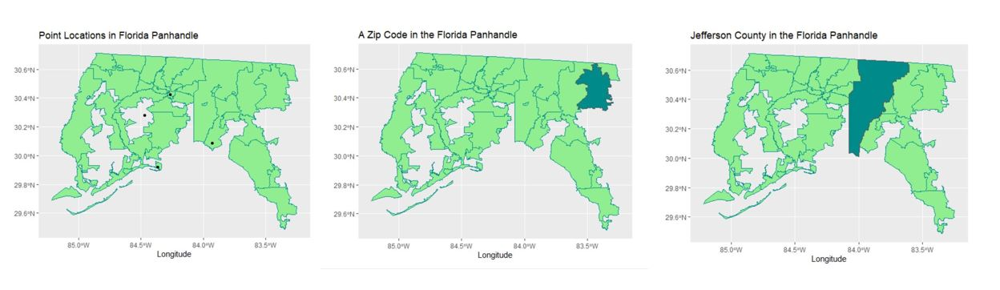

# Introduction

Tropical cyclones---which encompasses hurricanes as well as tropical storms and tropical depressions--- regularly threaten coastal communities across the Eastern and Southern United States. From 2000 to 2019, tropical cyclones cost the United States at least 811 billion dollars in damages[@NOAA billion dollar disasters]. Tropical cyclones in that same time frame resulted in 6,010 human fatalities, averaging 301 deaths per year [@NOAA billion dollar disasters]. Tropical cyclones upset coastal communities and society by damaging property, disrupting local economies, and harming human health. This is why they are so critical to study. 

Tropical cyclones are environmental disaster events that are crucial for public health authorities and scientists to understand. Human mortality is an obvious consequence of these storms, and in 1992 Hurricane Andrew left 53 residents in Florida and surrounding states dead [@ahrens2005essentials]. However, many other chronic and long term health impacts have been observed in the aftermath of tropical cyclones.  Researchers have observed that in utero exposure to tropical cyclones leads to adverse birth outcomes. [@kinney2008autism] observed higher rates of autism in children born to mothers who had higher rates of storm exposure than children born to mothers who were exposed to later intensities. The scientific literature also reveals evidence of mental health outcomes associated with populations exposed to tropical cyclones. Survivors of tropical storms often report higher levels of depression, anxiety, and PTSD, due to reduced access to important medical and social services, property damages, poor sanitation, and displacement after storms. [@lieberman2017self] found higher levels of PTSD in New York City residents who were exposed to flooding after Hurricane Sandy. Beyond health impacts, both mental and physical, tropical storms create incredible strains on the economies of the Southeastern United States. The average cost of a tropical cyclone event in the US is 21.2 billion per event, CPI-adjusted [@NOAA billion dollar disasters]. 

Clearly, tropical cyclones dramatically impact the social, economic, and physical wellbeing of  coastal communities. These extreme weather events represent an environmental health threat that is not going to disappear, and given that coastal regions of the Southeastern US are experiencing population growth, it is likely that higher numbers of people will be put at risk in the future. Avoiding these risks is not possible, but building resilience in communities after they experience tropical cyclone events is key to mitigating damages and preparing for future disasters. Creating lasting and resilient communities in areas prone to tropical cyclones  requires that researchers understand which populations and locations are at the greatest risk for negative exposures to tropical storms. This requires data that allows researchers to assess where in space and time tropical storms occur, and also where in space and time individuals and populations are experiencing impacts from these storms. 

To investigate links between tropical cyclones and human impacts, investigators must collect two types of data: measures of exposure to the tropical cyclone and measures of outcomes among humans. A key challenge, however, is integrating these two types of data. For example: extensive physical exposure data is often available for tropical cyclones as they near and cross communities in the United States. This data can come both from established monitoring networks, like [NOAA network name?], but may also result from data collection efforts during or after the storm by atmospheric scientists and engineers seeking to characterize a storm. Researchers studying the human impacts of these storms, including epidemiologists, economists, and social scientists are interested in this data as well, but the differences in temporal and spatial resolution makes the data harder to use. Integrating physical exposure and human impact datasets is challenging because the human impact data and physical exposure data often do not have congruent resolutions. 

Here we explore cases and implications of integrating data at different temporal and spatial scales, focusing as an example on human impact studies of tropical cyclones in the US. We begin by investigating the reasons that spatial and temporal misaligment exist in the study of tropical cyclones. We then describe the main spatial and temporal scales used, and finally assess some of the consequences that result from integrating physical exposure data with human impacts data. 

# Data for studying the human impacts of tropical cyclones

For an observational study to investigate links between tropical cyclones
and human impacts, the study's investigators must collect data on two 
key items: measures of exposure to the tropical cyclone and measures of
outcomes among humans. In this section, we outline key sources of these 
two types of data, illustrating with examples from the TC-human impacts
literature. We highlight sources of the data, as well as the temporal and 
spatial scales at which they are commonly collected. This helps highlight
inherent challenges in leveraging large administrative datasets when 
studying the human impacts of tropical cyclones, as discordance in 
temporal and spatial scales between exposure and impact datasets can create challenges in integrating the two types of data within a joint model.  

## Physical Exposures

To study the human impacts of tropical cyclones, investigators must identify 
times and places where humans were exposed to these disasters. This exposure
assessment can be as simple as identifying a community or person as 
exposed or unexposed to a specific event, or can be more complex, assigning
continuous levels of exposure to various physical hazards of the storm, 
including severe winds, extreme rainfall, and coastal and inland flooding. 

This exposure assessment often leverages data collected by national or
international weather organizations, including the United States' National
Oceanic and Atmospheric Administration (NOAA). Atmospheric and weather data have
long been collected in a way that is designed to give a picture of
meteorological activity over vast geographic spreads, as such coverage is
critical for weather forecasting. Most countries have vast monitoring systems of
sensors at fixed weather monitoring stations, designed to automatically record a
data point at a fixed interval of time. Weather organizations typically
supplement these fixed-location measurements with other data, including data for
specific weather events. For example, NOAA's National Centers for Environmental
Information published reports on specific severe weather events through its
Storm Events database, while the US National Hurricane Center collects and
publishes storm-specific data on tropical cyclones in the North Atlantic [and?],
including the location and intensity of the storm along its track.

The specific data used for exposure assessment, as well as the data's temporal
and spatial scales, is often determined by whether exposure is based on distance
to the storm's track or on physical exposures from the storm (e.g., severity of
wind, flooding) and, if the second, which specific physical exposures are
considered. 

<!-- These monitoring systems are often the result of long-standing weather projects such as the National Hurricane Center Data Archive from NOAA (National Oceanic and Atmospheric Administration), and the NWS (National Weather Service).  -->
<!-- These data are often fine in temporal and spatial resolution, and large in geographic scope.  -->

### Storm Tracks

In some studies of the human impacts of tropical cyclones, exposure assessment
is based on the location of a community relative to the location of the
storm's track. These studies typically leverage data on tropical storm 
tracks, collected by weather organizations like the US National Hurricane
Center. 

Tropical cyclone storm tracks refer to the paths the storms take, and can be displayed on maps to visualize where the center of the storm (the eye of the tropical cyclone, if the storm is severe enough to have one) passes through. 
<!-- In the North Atlantic Basin, tropical cyclone paths have a tendency to move westward first, then curve north and sometimes northeastward before ending, although some storm tracks take very messy and circuitous paths.  -->
Satellite imagery and remote sensing can be used to detect the paths of tropical cyclones and hurricanes, and ground monitors measuring wind speed can also detect the movement of the storm. 
[Add something about how these data are all considered jointly by an 
expert at the NHC to come up with the final track data---see paper ...]
<!-- The location of the center of a tropical cyclone can be documented at specific point locations at different times, meaning that it has a very narrow spatial and also temporal resolution.  -->
These tracks are reported by different weather organizations, depending on 
the basin in which the storm occurs. In the North Atlantic basin, storm tracks
are reported by the US National Hurricane Center through the Hurricane Data second generation dataset (HURDAT2) which has information on the point location of storm centers, wind speed, and atmospheric pressure in six hour intervals of North Atlantic tropical cyclones since 1851 [@deryugina2017fiscal] [consider replacing this ref with one from the NHC]. 

For North Atlantic hurricanes, these tracking data are resolved to [10ths of
degrees] in latitude and longitude (about how many miles?), but are only
reported at six-hour intervals. [We might want to move the following
interpolation section later, to when we talk about integrating data at different
scales?] Interpolation between the reported time points can improve this
temporal resolution, and in more recent years, tracking observations have been
added at the time of landfall, so landfall location is well-resolved in the
data. In many cases, tropical cyclones follow fairly smooth, curving
tracks---for example, in the North Atlantic Basin tropical cyclone paths have a
tendency to move northwestward first, then curve northeastward. These smoother
tracks are reasonable to interpolate between six-hour reported locations.
However, some storm tracks take very messy and circuitous paths, and for these
interpolation between reported points may be more prone to error. [Are NHC GIS
products interpolated?] Distance to the storm's track from fixed
locations---like a county's center or a study member's residence---can be
measured using GIS tools.

Oftentimes these storm track data are used in tropical cyclone studies to assign exposure. Sometimes, distance from a storm track is used to assign counties or zip codes as exposed, as in [@yan2019tropical]. [More examples of this?] [We may not need the rest of this paragraph, at least not here---it may make more sense later when we talk about integrating] If distance from the storm track is used to assign exposure, a threshold will have to be chosen to determine whether or not a county or zip code is exposed. Larger distance thresholds will increase the number of counties defined as exposed, and potentially overestimate exposure. Smaller distance thresholds will decrease the number of counties defined as exposed and potentially underestimate exposure. In either case, misclassification of exposure could arise. [I think that sometimes
other criteria will also be used---for example, it has to be within a certain 
distance of the storm track *and* the central storm intensity at that point 
in the track had to be above a certain level. It may be helpful to add an 
example of this.]

Other times, exposure to a tropical cyclone is assigned only if the storm track passed through a county or zip code. This is the approach that was used in [@kinney2008autism]. [Any other examples of this?] [The rest of this paragraph may be something we want to move later, when we talk about integrating the two types of data.] Populations are not typically distributed in a uniform pattern across these spatial areas, and so using this method to assign exposure could also result in exposure misclassification for communities that are close to the storm track but not in the county or zip code that the storm track passed through. The reverse of this, where communities in exposed counties or zip codes are actually located farther away from the storm track is also plausible. 

### Wind Speed and Direction

For some studies of the human impacts of tropical cyclones, researchers will 
assess exposure based on the severity of physical hazards experienced, 
rather than solely on whether the storm passed near a residence or community. 
Tropical cyclones are associated with multiple hazards, with high wind and
flooding as two hazards often associated with human impacts.

Tropical cyclone-associated winds can be measured or modeling in a number of
ways. The central intensity of a storm's winds (i.e., the highest winds in 
any part of the storm) are used as a measure of the overall intensity of 
the storm. However, these central measurements are of limited use in determining
exposure for locations that were not directly hit by the storm, as they 
characterize the hazards only near the core of the storm. 
Long-term weather monitoring networks include ground-based wind instruments in set locations to measure wind speed and direction, such as wind vanes, anenometers, and aerovanes. These can provide wind speed measurements at specific locations
(the location of that ground-based station), and often provide measurements
at a high temporal resolution (e.g., [minutes? seconds?]). However, these
instruments can be prone to failure or destruction during very severe conditions, 
and so may be missing data during the worst tropical cyclone exposures.
<!-- In order to be accurate and effective, these ground based wind instruments must be placed above the roofs of buildings so that they can be exposed to free flowing air. Since this is not always the case, wind observations can consequently be erratic in nature.  -->
Geostationary satellites, which are positioned above a particular location, can measure wind speed and wind direction by observing the direction that clouds move in a given amount of time. Doppler radar can also be used to measure wind speed and direction. [Anything about the temporal and spatial resolution
of geostationary satellites and doppler radar?]
Finally, customized data collection campaigns are sometimes conducted to 
collect wind speed data during tropical cyclones. These are often conducted
over sea, rather than land, including through [flight data collections]. 
However, [any examples of data collection campaigns on land for a specific 
tropical cyclone, where people put out more monitors specifically near the
site of landfall, for example?].
 
Modeling can also be used to estimate tropical cyclone-associated winds at
specific locations. Wind speed models use central measurements of the storm, 
including its location and central intensity, to create a wind profile 
extending from the center of the storm. These models incorporate knowledge
from atmospheric science on patterns in wind fields and asymmetry in winds
around the storm's center. These models can be used to estimate winds at any
location relative to the storm, and so they provide complete spatial coverage. 
Temporal resolution is influenced by the temporal resolution of the tropical
cyclone tracking data, since that is the key input to the model, but this 
temporal resolution can be improved by interpolating tracking data to a finer
temporal resolution. [Limitations of modeling winds]

<!-- Wind speed is a common way to characterize exposure to tropical cyclones. To even be classified as a tropical cyclone, a storm must have wind speeds in excess of 74 miles per hour (64 knots).  -->
 
There are several examples of wind speed being used as a measure for assigning exposure, often by choosing a threshold wind speed that if attained in a zip code or county during the course of a tropical cyclone, makes it exposed. 
[@yan2020tropical] used the sustained maximum wind speed recorded at the center of counties. [Move the next two sentences later?] In this example counties were considered exposed to tropical cyclones if the sustained maximum wind speed was greater than 21 meters per second. Because this wind speed is taken from a monitor at the center of the county, it may not be representative of wind speeds in other parts of the exposed county, again contributing to potential misclassification of exposure. 
Another study that used wind speed to assign exposure was [@parks2021tropical], which categorized counties as exposed to tropical cyclones on days that they experienced peak sustained wind greater than or equal to 34 knots when the the cyclone was at the point of closest approach to the county. [Any other examples
of papers that used wind speeds for exposure assessment?]

### Flooding and Storm Surges

Due to intensive precipitation, and the threat of storm surges during and after tropical cyclones make landfall, flooding is a major consequence that has a number of impacts on the infrastructure, safety, and economic strength of communities. Flooding accounts for about 75% of declared federal disasters, costs an average of $8 billion in the US annually, and results in over 90 fatalities on average each year. [USGS, 2016]

There are several methods for measuring flooding and creating geospatial maps to show the extent and impact of flooding. One method is to measure high water marks. Typically, this involves sending people out to specific locations to record the high water marks, but this method is costly, requires intensive labor, and is difficult to acheive during or after flooding disasters [@li2018novel]. 

Another method is to use data from stream gauges. The United States Geological Survey (USGS) maintains stream gauges at monitored locations along bodies of water that regularly record information on water height and stream flow, often updating every fifteen minutes [@li2018novel]. There are some limitations to this method as well, for example these stream gauges are not systematically installed along water ways, meaning that information is not uniform, and the stream gauges are not useful if the water level rises above the limit of ground based gauges or washes gauges away entirely [@li2018novel]. 

Satellite imagery, aerial photography, and remote sensing can also be used to asses the extent and damage of flooding in the aftermath of tropical cyclone disasters, but issues pertaining to cloud cover and inclement weather can make high quality, consistent, and clear images difficult to acheive and therefore use in analyzing impacts [@li2018novel]. 


## Human Impacts of Tropical Cyclones

Where physical exposure data is often expansive and specific, owing to well established networks of weather monitoring stations, data on human impacts are spatially and temporally located within geopolitical, cultural, and administrative boundaries. This type of data is available often in the form of census records, hospitalization records and vitals statistics from hospitals and public health departments, disaster insurance claims, schools, and other systems that record human activities. Unlike the physical exposure data, these sources are often aggregated by geographic region and time, often out of convenience, or a need to preserve the anonymity and privacy of the people whose data is being used.  Researchers also will use such secondary datasets and sources to compare with primary data sources. For example in [@lieberman2017self], self reported flooding exposure data was compared to FEMA flooding exposure data. 

### Health Impacts

Tropical cyclones studies have documented associations between exposure to tropical cyclones and a number of health outcomes such as increased hospitalizations due to cardiovascular and respiratory effects [@yan2020tropical], autism in children from in utero exposure [@kinney2008autism], risk of preterm birth [@grabich2016hurricane], adverse mental health outcomes such as anxiety, depression, and PTSD [@lieberman2017self],[@scaramutti2019mental],[@bevilacqua2020understanding], increased risk of hypertension [@ferdinand2005hurricane], and injury and death [@lane2013health]. The health data that informed thesd studies comes from a number of public health agencies, both governmental and non-governmental that collect extensive information pertaining to deaths, acute and chronic illnesses, injuries, birth and pregnancy outcomes, and mental health conditions. This data provides researchers with a wealth of information on health related human impacts of tropical cyclones. 

Certain general health information can be accessed from data published by the
National Vital Statistics System of the National Center for Health Statistics
(NCHS) [@aschengrau2013essentials]. This organization has registration offices
in every U.S. state, Washington D.C., and New York City. Vital statistics from
birth certificates for example, are recorded and verified by medical
professionals and submitted to local health depaertments, which submit this
information to state health departments, which eventually send it to the NCHS
[@aschengrau2013essentials]. The NCHS also collects US mortality data through a
program it administers called the National Death Index
[@aschengrau2013essentials]; this particular data has to be obtained through
offices at the state level. Death certificates themselves will give the
information of the events that led to death, something of interest when
determining impacts of tropical cyclones. Because local health departments
typically exist at the county and state level, this health information will
often be aggregated at those levels. [Sometimes I think the aggregation is in
part for privacy, as well. Could we say something about that?] [What is the
temporal scale of these data? They may offer different levels for different
uses---for example, they may have open (completely public) data available by
month for some things, but then you have to apply and use data under constraints
if you're using daily resolution]. [Add examples of when data from NCHS are used
in tropical cyclone impacts research?]

There are many other sources of health data that contain information pertinent
to impacts from tropical cyclones such as the National Health Interview Survey,
National Notifiable Diseases Surveillance System, Planned Parenthood Federation
of America, Center for Disease Control, Pregnancy Risk Assessment Monitoring
System, and many others [@aschengrau2013essentials]. The key is to understand
that these data come from hospitals, public health departments and other
agencies at county and state levels. [What implications does this have in terms
of temporal and spatial scales? What are typical temporal and spatial scales
for data from these sources?] [Add examples of studies that have used these
sources for TC impact studies.]

[Consider adding a paragraph or sentences on health insurance claim data, which 
is another source for some health data. Meilin's paper and Robbie Park's paper
are two example of this, but there may also be others in our examples.]

[Consider adding a paragraph on collecting new health data for a study. I think
there are some examples from mental health studies---they create a study
population and determine health outcomes through a survey they administer one or
several times. In this case, they would have a point location for each study
subject (latitude and longitude of residence). The time resolution might not be
as precise, however---they may just be capturing "post" storm health, without a
big focus on how long after the storm. ]

### Social and Economic Impacts

There a wide variety of social and economic costs associated with tropical cyclones. Often large populations of people are displaced after tropical cyclone events, such as the Puerto Ricans who migrated to Florida after Hurricane Maria [@scaramutti2019mental]. Another crucial consequence of tropical cyclones is that homes, businesses, and commmunity infrastructure are damaged, often severly. This destruction alters local economies, sometimes leading to unexpected economic consequences. 

To study social changes after tropical cyclones, demographic details such as race, ethnicity, socioeconomic status, age, and political affiliation are interesting and often insightful details of information that can help to shine a light on the human impacts of tropical cyclones. For many researchers, this data can be gleaned from the US Census. The US Census is a valuable source of information that is updated and compiled every ten years by the US Bureau of the Census on many variables including ancestry, racial background, mortage, occupation, household size, etc.[@aschengrau2013essentials]. 

To quantify economic impacts of tropical cyclones, there are a variety of metrics that are used by researchers, such as studying how employment and earnings change before and after a tropical cyclone event. [@belasen2008hurricanes] built a generalized difference-in-difference (GDD) model to study the effects of hurricanes on county-level employment and county-level average quarterly earnings per worker in the state of Florida. Though the state of Florida was studied here, results from looking at the county level showed differences in economic impacts depending on the severity of the hurricane, and the intensity of it when the county was hit by it. 

Individual tax returns are another resource that researchers can use to estimate economic impacts from tropical cyclones. Tax returns and tax records can provide a wealth of information on the financial and economic situations of large numbers of individuals before and after a tropical cyclone event because they can be linked to individual residential addresses (a point location), which allows researchers to identify residents of an area before a tropical cyclone, and they can give information about wages, salaries, self-employment, unemployment insurance, the Social Security Disability Insurance program, and retirement accounts [@deryugina2018economic]. [@deryugina2018economic] did just this to study the economic impact of Hurricane Katrina on the city of New Orleans, by collected information on individual federal tax returns and third party information returns filed between 1999 and 2013. Because tax returns are linked to individuals with known residential addresses, tax returns allow researchers to observe economic impacts at a point location. 

Another great resource researchers can utilize for studying economic impacts of tropical cyclones is from insurance claims. 

# Spatial and Temporal Scales and Misalignment

Questions about the human impacts of tropical cyclones are multidisciplinary, and as such require datasets from different and sometimes seemingly disparate sources. The physical exposures of tropical cyclones that were mentioned above such as wind speed, storm tracks, precipitation, and flooding data come from monitors that are at fixed locations, sometimes at airports, sometimes the center of a county, and other times in organized gridded systems. In contrast, the data on human health, social, and economic impacts will come from hospitals, schools, census reports, insurance claims, tax returns, and other documents and records coming from typically more aggregated spatial levels like counties. 

Differences in spatial and temporal scales are also related to the study question that researchers are asking. If a study is concerned with birth outcomes for example, having weather data on the windspeed every several seconds may not be relevant, because birth outcomes related to storm exposure in utero may operate on a longer time scale. In [@grabich2016hurricane], the researchers looked at gestational periods and defined pregnancies as exposed to tropical cyclones if they happened before 20 weeks of gestation. If the researchers had been interested in a different question, for example acute injuries due to direct storm exposure, they would have chosen a smaller time scale. There is no correct spatial or temporal scale that works well for all research, it all depends on what is being asked and how that can be ascertained. Different scales allow the researchers to make certain inferences and determine how the results of a study can be interpreted. 

The remainder of this section will highlight the most common spatial and temporal scales typically used in tropical cyclone studies. These scales were chosen after conducting a literature review that covered a wide range of human impacts from tropical cyclones. First we will describe spatial scales starting from the smallest resolution of point locations, working up to the level of metropolitan areas and states. Next we will describe temporal scales most commonly used in tropical cyclone studies and again work from smallest to largest resolution. 

# Spatial Scales

The spatial scale that a researcher uses varies depending on the data available or sampling method used. In human impacts data finer spatial scales will correspond more often to residential or business addresses, while larger spatial scales will correspond to zip codes, counties, states, or even countries. Physical exposure data is often at a small point location, sometimes within a larger grid, based on where weather monitoring sensors are placed. In the following section we will outline the most common spatial scales used in tropical cyclone studies and include some examples from the literature where they were employed. 


```{r echo = FALSE, out.width="1.0\\textwidth", fig.align="center"}

```

### Point Location

Point locations are the smallest resolution of spatial data used to assess the exposure to tropical storms and hurricanes, that can be characterized by a specific latitude and longitude. Meteorological instruments, monitors, and sensors that collect information on physical exposures are at this spatial level, but human impacts data can also be represented at this spatial level. 

In many cases, researchers collect information on the study subject's residential address through some sort of a survey to assess point location  [@lieberman2017self], [@jaycox2010children],[@bayleyegn2006rapid]. These surveys are often designed to assess psychological needs of hurricane survivors, as well as medical, financial, and nutritional needs. For example in [@lieberman2017self], New York City residents provided their address in a self reported manner to look at associations between mental health outcomes and flooding data. This residential address served as a point location that could be mapped and was compared to flooding data maps created by FEMA.  

The obvious advantage of knowing the point location of a human impact is that when mapped, it can be overlayed with physical exposure data on a storm or storms to gauge a very accurate picture of exposure, taking full advantage of high data resolution. Since storm tracks are often spatially represented by the path of the storm's center, having point locations like geocoded residential addresses, allows researchers to measure how close individuals are to the storm's central track, and therefore categorize their exposure. Similarly, point locations can be integrated in a straightforward way with gridded exposure data, as might result from re-analysis datasets or ... [check with James Done about this], as each point location can be assigned the exposure level of the closest gridded measurement.

### Zip Code/County/Parish

While point locations are very useful, many of the papers cited used larger geographic areas to denote spatial exposure to storms. Zip codes [@bevilacqua2020understanding],[@lane2013health], are often used to aggregate groups of people living in a given area. Counties are at a higher aggregation level than zip codes [@kinney2008autism], [@grabich2016hurricane], [@grabich2016measuring], [@schwartz2018preliminary], [@harville2010population]. Often these levels seem to be used when a specific metropolitan area is being looked at, such as New York City after Hurricane Sandy [@lane2013health], and Houstan after Hurricane Harvey [@schwartz2018preliminary]. 

Aggregating exposure at the county level is convenient because it utilizes some of the most established methods for assigning exposure status: the storm track trajectory, and FEMA presidential disaster declarations [@grabich2016measuring]. Information on human impacts such as birth outcomes, hospitalizations, tax records, and demographic data are often recorded at this spatial level as well. 

There are several disadvantages and pitfalls to using this spatial level. For one, not all counties and zip codes(which are called parishes in Louisiana) are the same size or have the same population, so they may not be immediately comparable. Using the county/parish or zip code makes it easier for researchers to misclassify exposure. There are many ways that this can occur in a study on tropical storms; one common example is that counties selected as exposed are those that had the center of the storm pass through their county's physical boundaries. However it is very possible that some individuals lived in a county classified as exposed based on this criteria, but were in a region of the county far enough away from the storm center that they were not severely impacted. These individuals would be classified as exposed when they really were not and it could bias an apparetn association towards the null. Alternatively, individuals who lived in a unexposed county, but were near the border of an exposed county could be incorrectly categorized as being unexposed even if they actually experienced many of the effects of the storm. 

### State/Metropolitan Region

Many studies used the spatial level of entire states or specific metropolitan areas to gather information on those who were exposed. [@harville2010population] is an interesting paper because it looks at the state level as well as the regional and parish level. In this paper researchers observed birth outcomes in response to Hurricane Katrina in the state of Louisiana as a whole, the New Orleans metropolitan area, and Orleans parish, which is the heart of New Orleans. Looking at these three levels is a way to compare different incident rates and other measures of associations across different spatial scales. 

The state or national level is the spatial level of an ecological study and can be useful to compare the emergency preparedness and policies of different states. It can also reveal inequities in government response to natural disasters. For example, in [@willison2019quantifying], researchers quantified the federal responses to Hurricanes Irma, Harvey, and Maria in Texas, Florida, and Puerto Rico. They determined that in terms of federal spending and staffing, Hurricane Maria in Puerto Rico was not responded to in a manner commensurate with damage and need for aid compared to Hurricanes Irma and Harvey in Texas and Puerto Rico. 

# Temporal Scales

Thanks to scientitific institutions such as NOAA and the National Weather Service, there are large networks of sensors and monitoring equipment established across the United States that are capable of recording physical exposure data at a fine temporal level. It is possible to know the wind speed, amount of rainfall, and air temperature at very fine temporal scales throughout the duration of a tropical cyclone event. Human impacts data however, is typically not available at such a fine scale, nor is such a scale sometimes even relevant. Whereas physical exposure data may be collected in real time during the storm, many of the human impacts that researchers are interested in may be only known after the storm, and thus estimations may have to be made of what happened in the past. Below are some examples of time scales that are more applicable to a human scale, and why aggregating physical exposure data to these units of time may be necessary. 

### Real Time (Minutes, Hours)

Many physical exposures, like the ones mentioned above (storm tracks, wind speed, flooding, precipitation, storm surges) are recorded by various instruments and measuring devices both on the ground and above using radar, satellite imagery, etc. 

### Day and Week

In the event of a tropical cyclone, there are several situations in which the temporal unit of a day may be used to analyze exposure. Physical exposure data from tropical cyclones will typically be available at this scale anyways, but some studies will look at time series and use daily exposure data from hospitalizations and visits to the emergency room. 

One study, [@zahrah2013daily] looked at casualty counts per day for counties in the Southeastern United States that were exposed to tropical cyclones. 

Week is a very common unit of time used to ascertain exposure, particularly for studies that are concerned with birth outcomes and gestation during hurricane exposure [@kinney2008autism], [@grabich2016hurricane], [@grabich2016measuring]. When the week of gestation is known, the timing that the hurricane makes landfall, or has its storm center pass through a county can be matched up to this week of gestation to identify possible "critical periods" of exposure during development. 

### Cumulative Measures of Time

It is often the case that specific physical exposures are not considered in real time to ascertain human impacts. Instead, human impacts are assessed after the storm has passed, often noting the number of days or weeks that have passed since the hurricane made landfall. This method is common when assessing damages, recovery efforts, and when human impacts are self reported. When this is the case, it is often useful to take an aggregate exposure an aggregate measure of physical exposure corresponding to this time frame, such as the maximum wind speed or maximum flooding level over the period of time being studied. 

Other times, it is useful to look at cumulative measures of time but also divide that period up by a certain time unit. For example, in [@grech2015hurricane], male and female birth ratios were observed monthly from January 2003 to December 2012 in order to observe trends before and after Hurricane Katrina. In this example we can see that a large time frame of several years is studied, but it is divided by months. 

# Implications of not improving this integration

Temporal and spatial misalignment poses certain challenges to researchers investigating the human impacts of tropical cyclones. Integrating data at different spatial scales is often accomplished by aggregating one set of data to match the data that is at a greater scale. Sometimes however, misalignment exists not at different scales, but at the same scale in different places, such as a residence that is miles away from the nearest weather monitor. In cases such as this, physical exposure is assigned by matching residences or addresses to the nearest monitor, or an interpolation model will be created to estimate exposures. In the following sections we will discuss aggregation and some of the implications that arise from it. We will then describe matching and interpolating and similary describe the implications that result from these methods. 

## Aggregating to Integrate Data at Different Scales

Aggregating physical exposures is what researchers do by assigning a single exposure value to a wider spatial area, such as a zip code or county. Since the human impacts data available will often be at this scale anyways, the finer physical exposure data will be generalized to this level as well.  This can be done in a number of ways, such as taking a wind speed measurement from a monitor at the center of the county. This wind exposure value will then be assigned to the entire county. Windspeed at the moment a tropical cyclone makes landfall is another exposure assignment method, as was done in [@shao2017understanding], in which the maximum wind speed when a tropical cyclone made landfall in a particular coastal county was used to assign that particular county's exposure.  Cumulativie rainfall in the entire county, distance of the county from the storm track, number of tornadoes in the county, and floodindg in the county are other methods of assigning an aggregate exposure value to a certain region. 

It is often the case that these aggregated values will be determined to categorize a county or other spatial area as exposed or unexposed, based on some kind of threshold.  In [@parks2021tropical], researchers considered counties exposed if the peak sustained wind that day exceeded a gale force greater than or equal to 34 knots on the Beaufort scale when the cyclone was at the point of closest approach to the county. Entire counties will also be categorized as unexposed or exposed based on whether the storm track of the tropical cyclone passed through their borders or not. 

The Saffir-Simpson scale is an example of how entire storms are often classified by their maximum wind speed. Forecasters classify hurricanes into categories on the Saffir-Simpson scale based on maximum sustained surface wind speed. This is defined as the peak one minute wind speed at a height of 10 feet over an unobstructed exposure [@taylor2010saffir]. The Saffir-Simpson scale uses five different bins to classify varying levels of wind speed and determine the severity of a storm. The first level, Category 1 is designated for hurricanes and tropical storms with maximum wind speeds of between 64 - 82 knots and is generally considered dangerous to people, livestock, and pets from the hazard of flying and falling debris [@taylor2010saffir]. On the higher end of the scale, Category 5 designates hurricanes with maximum wind speeds above 137 knots and is considered to have catastrophic effect on damage and a high probability of injury or death to people, livestock, and pets even if they are sheltering indoors [@taylor2010saffir]. An important limitation of the Saffir-Simpson scale is that it doesn't account for other hurricane-related impact variables such as storm surges, flooding, and tornadoes [@taylor2010saffir]. [@shao2017understanding] used this scale to assign wind speed categories to counties along the Gulf Coast in a study assessing perceptions of risk to tropical cyclones. [@belasen2008hurricanes] used this scale as well in a study that compared hurricane intensities to average earnings in different counties. Hurricanes with categories one, two or three were considered lower intensity, and hurricanes of counties four and five were considered high intensity. 

### Implications of Aggregating Data 

When researchers have physical exposure data at a very fine resolution, perhaps even continuous, and human impacts data at a more aggregate level, it is common and practical to aggregate the physical exposure data. When dealing with aggregated data of any kind, it is important to realize that information on the individual level is lost. Researchers should be mindful when aggregating data, particularly continuous data, that they are losing information. In this section we will discuss some of the major implications of aggregating data which include ecological bias, misclassification and measurement error, and the process of categorizing continuous data.

### Ecological Bias

Physical exposures to tropical cyclones, as well as human impacts, are observed across spatial gradiants, and though specific point locations may exist for a weather monitor recording maximum wind speed or rainfall, that point location data is often aggregated to a larger spatial unit. For example, several weather monitors at specific point locations recording maximum wind speed may be replaced by the maximum wind speed at the center of the county. Data such as this is known as ecological  data, aggregate data, or contextual-level data. Studies that use such data are known as ecological studies [@sedgwick2014ecological]. Ecological bias occurs whenever the aggregate association between an exposure and an outcome does not properly reflect the association on the individual level [@greenland1989ecological]. There are times when this is not a concern, such as when the aggregate is a count. For example in [@zahran2013daily], the daily casualty count was reported for individual counties in the Southern United States, using count data from the Spatial Hazard Events and Losses Database. However, when estimates derived from ecological studies are used to infer individual estimates, ecological bias will likely be present. Especially when there is heterogeneity present in an aggregated population, an ecological estimate should not be taken to be representative of individual estimates. 

### Misclassification and Measurement Error in Aggregating Data

When aggregating data, another concern that arises is misclassification or measurerement error. Misclassification error occurs when exposure and outcome variables are measured in categories and the wrong category is assigned to a particular case/observation - for example when a case that is exposed is incorrectly categorized as unexposed. Failure to classify exposure accurately(for example, classifying certain observations as exposed to a storm when they really were not, or vice-versa), allows misclassification bias to move the results of the study further from the true parameter. Measurement error occurs when the variables being measured are continuous, such as the amount of precipitation or the wind speed that was measured during a tropical cyclone. 

Environmental epidemiology studies are often prone to misclassification error because the methods of assessing exposure are not always congruent with the way that researchers conduct human impact studies. It is easy to map the path of a tropical cyclone's center, and categorize every county it passes through as an exposed county. However, this information by itself would not give the researcher any information about population centers that the storm track got close to. A town within an exposed county may or may not have been close to the storm's path. Conversely,a town in an unexposed county could be located very close to the border of an exposed county, and even be closer to the storm's track than a different town within that exposed county. An example of a study that could be prone to this kind of bias is [@kinney2008autism] where Louisiana parishes were considered vulnerable to hurricane exposure based on whether or not the storm center passed through that parish. It is possible that the cases considered exposed based on living in these parishes were not in fact exposed since the storm may have passed through only a certain part of the parish. Never the less, all cases in a parish are considered exposed or unexposed in the aggregate. 

####[Need to figure a way to conclude this section]####

##  When Data Have the Same Scale but are at Different Locations

Sometimes, researchers may have access to data that is down to the point source, both for physical exposures and also for human impacts. Very likely however, these point sources will not be the same. Here the issue is not of integrating different resolution levels, but rather of matching different point locations. Weather monitoring stations may be set up regularly in a geographic region, sometimes in regular grids, but the human impacts point locations could be tied to a single residential address that is likely not at a weather station or in a grid. 

One way to resolve this spatial misalignment is to assign exposure to the residential addresses based on the closest weather monitoring station [@kim2009health]. This is a common method that is employed in many other areas of environmental epidemiology, including studies on the impacts of wildfire smoke plumes and urban smog on respiratory health. Typically, a distance threshold will be determined for a monitoring station or a sensor, and any residence within that distance will be assigned an exposure value from that monitoring point. 

There are several drawbacks to assigning exposure to human residences based on distance from a weather monitoring stations. One of them is that in more rural areas, in situ observations may be sparse and this limits the information between monitors, and diminishes the accuracy of exposures assigned to individuals located between those monitors [@gan2017comparison].The exposed population is also reduced when you rely on distance from monitoring sites, because you can only include individuals who are close enough to reasonably be assigned the exposure from that site [@lassman2017spatial]. This can be a problem, as large populations are often required for detection of health impacts. Depending on the exposure of interest, topography, climate, and localized weather patterns will also render sites beyond a limited threshold distance from the site as unrealistic to be assigned the value from the monitoring station. 

Another method of assigning exposure to spatially misaligned individuals is to interpolate, using models. Spatial interpolation is the prediction of values or metrics of specific points within a defined region based on some sort of spatial model [@li2014spatial]. Kriging is one such method that creates continuous spatial surfaces for understanding environmental variables like air pollution, minerals, soil, and meteorological conditions [@liang2013time]. It is a type of Generalized Least Square Regression Algorithm [@li2014spatial]. This method has been used extensively in modeling the effects of air pollution in places like California, as was done in [@kim2009health] to look at air pollution exposure in Los Angeles, California. The study utilized  a kriging model and as well as using the nearest weather monitoring station to assign air pollution exposure to residential locations in Los Angeles. Kriging is widely applicable to studies of tropical cyclones as well. Researchers in South Carolina used kriging interpolation to analyse rainfall data and create spatio-temporal model in 2015 during a particularly strong storm season. 

A limitation of both matching physical exposure monitors to residences, and using interpolation models to infer exposure values, is that meteorological events can damage these monitors. Strong storm events that produce high enough winds can blow away or damage senors. If precipitation is being measured, rain that comes down in slants can also make measurements less accurate. These are issues that are particularly concerning for ground based monitors. 

The more complicated that a model becomes, the harder it is to interpret. This is why the most simple method that can be utilized (sometimes simply matching human point locations to the nearest monitor) is the best way to go. Some exposures, like wind speed, are relatively homogenous over large areas, so the different methods will not give much variation in results. 

### Misclassification for Same Scale Different Locations

The obvious goal of assigning tropical cyclone exposures to individual point locations by matching values from the nearest monitoring site or spatially interpolating, is to estimate exposure values accuarately. This is crucial to avoid exposure misclassification. The more spatially heterogeneous that an environmental exposure is, the more room there is for exposure misclassification to occur. In studies of wildfires and air pollution, concentrations of PM2.5 and other air pollutants can very greatly within relatively small spatial areas. Other factors like windspeed and rainfall however, are fairly homogenous across spatial areas. This means that interpolating and assigning exposure based on the nearest monitoring sites may result in less exposure misclassificationhave. Tornadoes on the other hand tend to be very localized and can easily be overlooked with these methods. 

When assigning exposure to an individual point location based on the nearest monitoring site, the further this location is from the monitoring site, the more likely it is that the monitoring site won't reflect an exposure estimate accurately. Topography, complicated weather patterns, and other things could complicate this measurement. 

When interpolating, the environmental exposure of concern will partially determine the potential for misclassification. Using the examples from above of windspeed and rainfall, it is unlikely that much misclassification would occur over a spatial interface since they are homogenous over large areas. 


# Conclusion/Discussion 

The aim of this paper has been to show that studying the human impacts of tropical cyclones requires use of multiple datasets from different sources, at different temporal and spatial scales, and resulting from different data collection methods. We've shown how physical exposure data from tropical cyclones usually comes from point location monitors and sensors such as rain and stream gauges, wind vanes, at weather stations that are often a part of large scale networks operated by NOAA and the NWS. We've shown how in contrast to this, that data on human impacts comes from administrative sources at hospitals, schools, and governments, often at the level of the zip code or county. These differences in temporal and spatial scale make use of the data difficult for researchers to immediately utilize. Nevertheless, several methods exist for integrating these datasets, and we've briefly described aggregation, interpolation, and matching as the main methdos for doing this. Though useful, these methods are not without their limitation, such as their propensity towards ecological bias and exposure misclassification. 

Ecological bias and exposure misclassification are a problem, because they impact the external validity of tropical cyclone studies. If not adequately mitigated, they can produce measures of association that do not reflect the true impact that tropical cyclones have on coastal communities. In other words, these kinds of bias and error make tropical cyclone studies less generalizable, which renders them less effective in predicting for future events and preparing for them. That leaves large gaps of uncertainty when it comes to creating resilient communities that can withstand tropical cyclone events, and leaves more vulnerable populations and communities at an elevated risk. [Cite Daniel's paper]

There is reason to be optimistic that we can harness the power of large datasets on physical, and increasing precision in model building, to understand and predict the effects of tropical cyclones on human health, economic viability, infrastructure, and social dynamics. This is of course contingent on our ability as researchers to make sure that the data on human impacts is of a similar quality and translatable resolution as the high quality data we already have on physical exposures. With larger populations expected to live in areas threatened by tropical cyclones in the future, this is an extremely important undertaking for interdisciplinary teams of meteorologists, epidemiologists, economists, and diaster planners. 

# References
